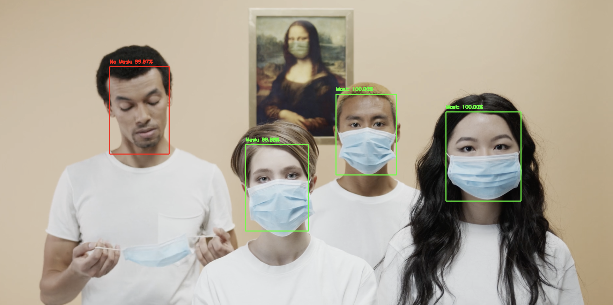

# ***[Face Mask Detection Using OpenCV](#visualization)***

_Face Mask Detection is the task of recognizing if a person is wearing a mask or not using Machine Learning technology._

## ***Data source***

All the dataset is downloaded from [here](https://github.com/X-zhangyang/Real-World-Masked-Face-Dataset)

## ***Technologies***
- _Keras: A high-level, deep learning API for implementing neural networks._
- _Tensorflow: An open-sourced end-to-end platform, a library for multiple machine learning tasks._ 
- _OpenCV: A library of Python bindings designed to solve computer vision problems._
- _[CaffeModel](https://caffe.berkeleyvision.org/model_zoo.html): A machine learning model created by Caffe, which contains an image classification or image segmentation model that has been trained using Caffe._

## ***Setup*** 
_Open Pycharm terminal and run  `pip install -r requirements.txt` and `python xxxx.py`_

## ***Detect image or live camera***

_Run `python3 mask_detection_image.py --image images/sample1.png` to detect one image_

_Run `python3 mask_detection_video.py ` to start live camera_

## ***Visualization***

